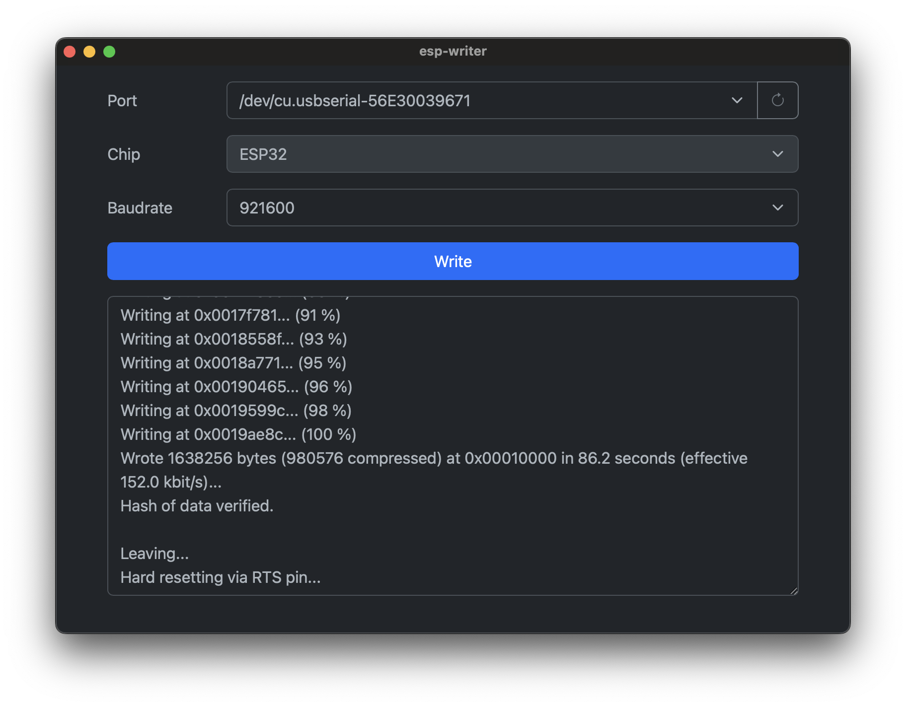

# ESPマイコンファームウェア書き込みツール




## 環境構築

### パッケージインストール
```
npm install
```


### sidecarの実行ファイルを格納

#### フォルダ作成
```
mkdir src-tauri/sidecar-app
```

#### Pythonの実行ファイル作成
[参照](src-python/README.md)


## 実行
```
npm run tauri dev
```


## 実行ファイル作成

### ビルド
src-tauri/target/release/bundleに出力される
```
yarn tauri build --bundles app
```
